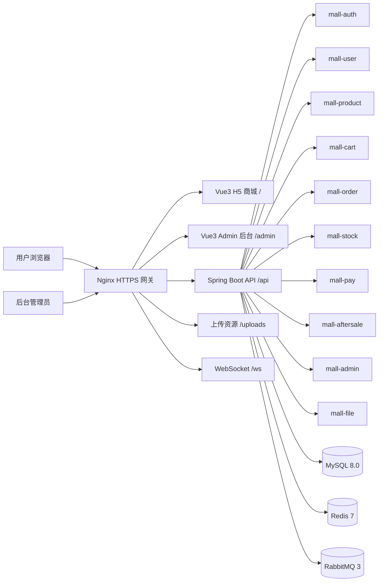
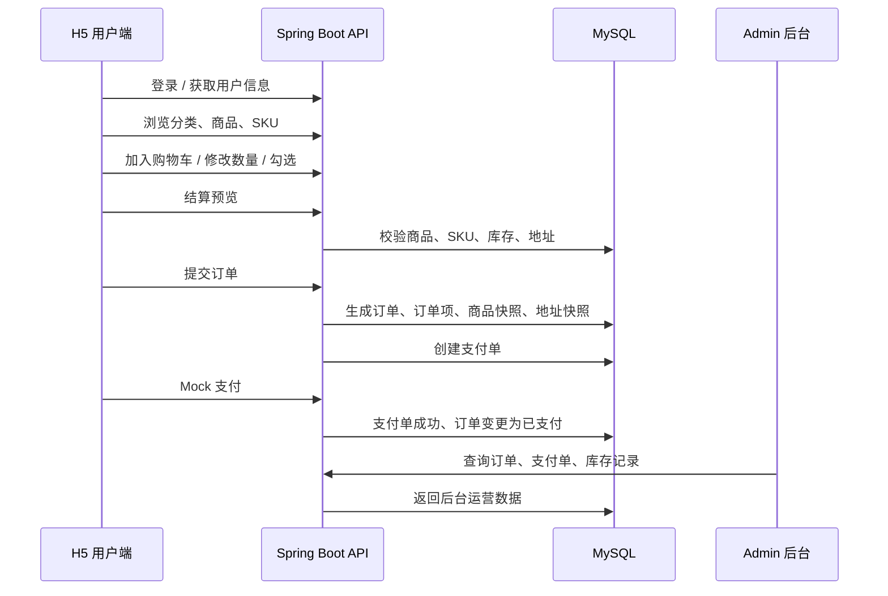

# mallFei

<p>
  <a href="https://mallfei.cloud"></a>
  <a href="https://mallfei.cloud/admin"></a>
  <a href="https://mallfei.cloud/api/swagger-ui/index.html"></a>
  
  
  
  
  
  
</p>

## 友情提示

> 1. **在线体验项目**：H5 商城：[https://mallfei.cloud](https://mallfei.cloud) 。
> 2. **后台管理系统**：[https://mallfei.cloud/admin](https://mallfei.cloud/admin) 。
> 3. **接口文档**：[https://mallfei.cloud/api/swagger-ui/index.html](https://mallfei.cloud/api/swagger-ui/index.html) 。
> 4. **项目定位**：本项目是面向面试展示与企业级电商业务实践的 B2C 电商系统，覆盖 MVP 到一期增强阶段。
> 5. **演示账号**：为避免线上数据被误操作，H5 与 Admin 测试账号建议在面试或沟通时提供。
> 6. **截图说明**：建议将 `项目运行截图.docx` 中的截图导出到 `documents/screenshots/`，在 README 中展示关键页面。

## 前言

`mallFei` 是一个从 0 到 1 搭建的企业级 B2C 电商项目，目标是完整覆盖电商系统中的用户、商品、SKU、购物车、订单、库存、支付、售后、后台运营、权限控制、操作日志、接口文档和云端部署等核心能力。

项目采用 **Spring Boot 3 + MyBatis-Plus + MySQL + Redis + RabbitMQ + Vue 3 + Vite + Nginx HTTPS** 技术栈，包含 C 端 H5 商城、Admin 后台管理端和后端多模块服务，支持线上 HTTPS 访问和前后端完整联调。

## 项目文档

项目需求、阶段设计和功能梳理文档位于：

```text
documents/
```

主要文档包括：

- B2C 电商 MVP 项目开发主文档
- B2C 电商一期及一期增强阶段正式开发设计文档
- B2C 电商二期运营履约能力指导主文档
- B2C 电商三期平台经营能力开发主文档
- B2C 电商四期生产治理能力开发主文档
- B2C 电商五期平台化与智能化能力开发主文档
- mallFei 项目已实现业务功能阶段梳理
- 大型企业级 B2C 电商平台总体目标指导文档

## 项目介绍

`mallFei` 项目是一套 B2C 电商系统，包括 **前台 H5 商城系统**、**后台 Admin 管理系统** 和 **Spring Boot 多模块后端服务**。

前台商城系统包含用户登录、个人资料、地址管理、商品分类、商品列表、商品详情、SKU 选择、购物车、结算预览、订单提交、Mock 支付、订单列表、订单详情、售后申请等模块。

后台管理系统包含仪表盘、用户管理、商品分类管理、SPU/SKU 管理、商品上下架、库存管理、库存日志、订单管理、支付管理、售后管理、账号权限管理、操作日志、对账管理等模块。

后端服务采用 Maven 多模块组织，按业务领域拆分为用户、认证、商品、购物车、订单、库存、支付、售后、后台、文件、通用能力和启动模块，便于维护和扩展。

---

## 项目演示

### H5 商城系统

项目演示地址：

[https://mallfei.cloud](https://mallfei.cloud)

建议使用浏览器手机模式访问，主要演示：

- 用户登录与个人中心
- 地址管理
- 商品分类与商品列表
- 商品详情与 SKU 选择
- 购物车数量和勾选状态维护
- 结算预览与提交订单
- Mock 支付
- 订单列表与订单详情
- 售后申请

> 截图建议放置位置：`documents/screenshots/h5-home.png`

```markdown

```

### 后台管理系统

项目演示地址：

[https://mallfei.cloud/admin](https://mallfei.cloud/admin)

主要演示：

- 后台登录 / 退出
- 仪表盘经营指标
- 商品分类 / SPU / SKU 管理
- SKU 库存管理与库存日志
- 订单管理与订单详情
- 支付单管理
- 售后审核
- 账号角色权限
- 操作日志
- 对账管理

> 截图建议放置位置：`documents/screenshots/admin-dashboard.png`

```markdown

```

### 接口文档

Swagger UI：

[https://mallfei.cloud/api/swagger-ui/index.html](https://mallfei.cloud/api/swagger-ui/index.html)

OpenAPI JSON：

[https://mallfei.cloud/api/v3/api-docs](https://mallfei.cloud/api/v3/api-docs)

---

## 组织结构

```text
mallFei
├── backend                         # Spring Boot 3 + Maven 多模块后端
│   ├── mall-common                 # 通用响应、异常、枚举、工具类
│   ├── mall-auth                   # 认证、Sa-Token、登录态、权限配置
│   ├── mall-user                   # C 端用户、地址、个人资料、第三方登录
│   ├── mall-product                # 商品分类、SPU、SKU、销量统计
│   ├── mall-cart                   # 购物车、勾选状态、结算前校验
│   ├── mall-order                  # 订单、订单项、订单状态流转、订单快照
│   ├── mall-stock                  # 库存、库存锁定、库存日志、库存预警
│   ├── mall-pay                    # 支付单、Mock 支付、支付回调、退款
│   ├── mall-aftersale              # 售后、退款申请、审核流程
│   ├── mall-admin                  # 后台管理、账号权限、运营管理
│   ├── mall-file                   # 文件上传、本地/对象存储适配
│   ├── mall-start                  # Spring Boot 启动模块
│   ├── scripts                     # 自动化冒烟测试与接口测试脚本
│   └── sql                         # 数据库结构和初始化脚本
├── frontend
│   ├── mall-h5                     # Vue3 + Vite + Vant H5 商城
│   └── mall-admin                  # Vue3 + Vite + Element Plus 后台管理
├── documents                       # 需求文档、设计文档、项目截图
├── docker-compose.yml              # MySQL / Redis / RabbitMQ 基础设施
└── README.md
```

---

## 技术选型

### 后端技术

| 技术 | 说明 | 官网 |
| --- | --- | --- |
| Spring Boot 3.3.5 | Web 应用开发框架 | https://spring.io/projects/spring-boot |
| Java 21 | 后端开发语言与运行环境 | https://www.oracle.com/java/ |
| Maven | 项目构建与多模块管理 | https://maven.apache.org/ |
| MyBatis-Plus 3.5.7 | ORM 与数据访问增强 | https://baomidou.com/ |
| MySQL 8.0 | 关系型数据库 | https://www.mysql.com/ |
| Redis 7 | 缓存与登录态支持 | https://redis.io/ |
| RabbitMQ 3 | 消息队列 | https://www.rabbitmq.com/ |
| Sa-Token 1.39.0 | 登录认证与权限控制 | https://sa-token.cc/ |
| Spring AMQP | RabbitMQ 集成 | https://spring.io/projects/spring-amqp |
| Springdoc OpenAPI | Swagger API 文档 | https://springdoc.org/ |
| BCrypt | 密码加密 | https://spring.io/projects/spring-security |
| Nginx | 反向代理与静态资源服务 | https://nginx.org/ |
| Docker | 基础设施容器化 | https://www.docker.com/ |

### 前端技术

| 技术 | 说明 | 官网 |
| --- | --- | --- |
| Vue 3 | 前端框架 | https://vuejs.org/ |
| Vite 6 | 前端构建工具 | https://vitejs.dev/ |
| Vue Router | 前端路由 | https://router.vuejs.org/ |
| Pinia | 状态管理 | https://pinia.vuejs.org/ |
| Axios | HTTP 请求库 | https://axios-http.com/ |
| Vant 4 | H5 移动端 UI 组件库 | https://vant-ui.github.io/vant/ |
| Element Plus | Admin 后台 UI 组件库 | https://element-plus.org/ |
| ECharts | 后台图表与数据看板 | https://echarts.apache.org/ |
| xlsx | 后台 Excel 导出 | https://github.com/SheetJS/sheetjs |

### 部署技术

| 技术 | 说明 |
| --- | --- |
| Ubuntu Server | 云服务器运行环境 |
| Nginx HTTPS | 全站 HTTPS、80 跳转 443、反向代理 |
| Docker MySQL | 数据库容器化运行 |
| Docker Redis | Redis 容器化运行 |
| Docker RabbitMQ | RabbitMQ 容器化运行 |
| Spring Boot 进程 | 后端服务运行 |
| 静态资源部署 | H5 与 Admin 分目录部署 |

---

## 架构图

### 系统架构图



### 核心业务链路图



---

## 模块介绍

### 前台商城系统 `frontend/mall-h5`

- 首页门户
- 商品分类
- 商品列表
- 商品详情
- SKU 选择
- 购物车
- 结算预览
- 地址管理
- 订单流程
- Mock 支付
- 订单中心
- 个人中心
- 售后申请

### 后台管理系统 `frontend/mall-admin`

- 仪表盘
- 用户管理
- 商品管理
- 分类管理
- 库存管理
- 库存日志
- 订单管理
- 支付管理
- 售后管理
- 对账管理
- 账号权限
- 操作日志
- 个人中心

### 后端业务模块

| 模块 | 说明 |
| --- | --- |
| `mall-common` | 通用响应、分页、异常、枚举、密码加密、认证注解 |
| `mall-auth` | Sa-Token 登录态、权限校验、会话管理、强制下线 WebSocket |
| `mall-user` | 用户注册登录、个人资料、地址管理、第三方登录配置 |
| `mall-product` | 分类、SPU、SKU、商品快照、销量统计 |
| `mall-cart` | 购物车、数量维护、勾选状态、结算校验 |
| `mall-order` | 订单创建、订单项、订单状态、地址快照、商品快照 |
| `mall-stock` | SKU 库存、库存锁定、库存日志、库存预警、一致性校验 |
| `mall-pay` | 支付单、Mock 支付、支付回调、退款单、支付对账 |
| `mall-aftersale` | 售后申请、售后审核、退款处理 |
| `mall-admin` | 后台账号、角色权限、运营管理、日志审计 |
| `mall-file` | 文件上传、本地存储和对象存储适配 |
| `mall-start` | 应用启动、全局配置、OpenAPI、MyBatis 配置 |

---

## 功能清单

### MVP 核心能力

- 用户注册并登录
- 用户维护个人资料
- 地址新增、编辑、删除、设置默认
- 后台管理员登录
- 后台维护分类、SPU、SKU
- 后台维护 SKU 库存
- C 端查看分类、商品列表、商品详情
- C 端选择 SKU 加入购物车
- 用户修改购物车数量和勾选状态
- 用户进行结算预览
- 用户选择地址提交订单
- 系统生成订单和订单项
- 订单项保存商品名称、图片、价格等快照
- 订单保存收货地址快照
- 下单时完成基础库存校验和处理
- 系统创建支付单
- 用户通过 Mock 支付完成支付
- 支付成功后支付单状态变为成功
- 支付成功后订单状态变为已支付
- 用户查看订单列表和订单详情
- 用户不能查看他人订单
- 后台查看订单、用户、库存
- C 端和 Admin 端核心流程完整联调
- 接口文档覆盖 MVP 核心接口
- MVP 主链路无阻断性异常

### 一期增强能力

- 后台仪表盘经营数据
- 后台账号、角色、权限管理
- 管理员强制下线与登录态治理
- 用户禁用 / 启用管理
- 商品上下架与违规处理
- 商品销量统计与阈值配置
- 库存预警与库存日志
- 库存一致性校验
- 订单发货、完成、异常处理
- 支付单同步、关闭、修复
- 售后申请与后台审核
- 支付回调记录
- 支付 / 库存对账管理
- 操作日志审计
- Admin 子路径部署与 H5 路由隔离

---

## 开发进度

| 阶段 | 状态 | 说明 |
| --- | --- | --- |
| MVP 阶段 | 已完成 | 用户、商品、购物车、订单、库存、支付主链路 |
| 一期增强 | 已完成主要能力 | 后台运营、权限、履约、售后、日志、对账基础能力 |
| 二期规划 | 规划中 | 更完整履约、营销、优惠券、物流能力 |
| 三期规划 | 规划中 | 平台经营分析、数据看板、运营策略 |
| 四期规划 | 规划中 | 生产治理、监控、对账、自动修复 |
| 五期规划 | 规划中 | 平台化、智能化、推荐与自动化运营 |

---

## 环境搭建

### 开发工具

| 工具 | 说明 | 官网 |
| --- | --- | --- |
| IntelliJ IDEA | Java 后端开发 IDE | https://www.jetbrains.com/idea/ |
| Cursor / VS Code | 前端与全栈开发工具 | https://code.visualstudio.com/ |
| Docker Desktop | 本地容器运行环境 | https://www.docker.com/ |
| Navicat / DBeaver | 数据库客户端 | https://dbeaver.io/ |
| Postman / Apifox | API 调试工具 | https://www.postman.com/ |
| PowerShell | 自动化测试脚本运行 | https://learn.microsoft.com/powershell/ |
| Git | 版本控制 | https://git-scm.com/ |

### 开发环境

| 工具 | 版本 |
| --- | --- |
| JDK | 21 |
| Maven | 3.9+ |
| Node.js | 18+ / 20+ |
| MySQL | 8.0 |
| Redis | 7.x |
| RabbitMQ | 3.x Management |
| Nginx | 1.20+ |

### 本地启动基础设施

项目根目录执行：

```bash
docker compose up -d
```

默认服务：

| 服务 | 地址 |
| --- | --- |
| MySQL | `127.0.0.1:3306` |
| Redis | `127.0.0.1:6379` |
| RabbitMQ | `127.0.0.1:5672` |
| RabbitMQ 控制台 | `http://127.0.0.1:15672` |

### 初始化数据库

建议数据库名：

```text
mall_fei
```

数据库脚本目录：

```text
backend/sql
```

### 启动后端

```bash
cd backend
mvn clean package -DskipTests
cd mall-start
mvn spring-boot:run
```

本地后端地址：

```text
http://127.0.0.1:9090
```

常用环境变量：

```bash
SPRING_PROFILES_ACTIVE=local
MALL_MYSQL_HOST=127.0.0.1
MALL_MYSQL_PORT=3306
MALL_MYSQL_DATABASE=mall_fei
MALL_MYSQL_USERNAME=root
MALL_MYSQL_PASSWORD=123456
MALL_REDIS_HOST=127.0.0.1
MALL_REDIS_PORT=6379
MALL_RABBITMQ_HOST=127.0.0.1
MALL_RABBITMQ_PORT=5672
MALL_RABBITMQ_USERNAME=guest
MALL_RABBITMQ_PASSWORD=guest
```

### 启动 H5 商城

```bash
cd frontend/mall-h5
npm install
npm run dev
```

默认地址：

```text
http://127.0.0.1:5173
```

### 启动 Admin 后台

```bash
cd frontend/mall-admin
npm install
npm run dev:local
```

默认地址：

```text
http://127.0.0.1:5174
```

---

## 前端构建与部署

### H5 商城构建

```bash
cd frontend/mall-h5
npm run build
```

构建产物：

```text
frontend/mall-h5/dist
```

### Admin 后台构建

```bash
cd frontend/mall-admin
npm run build
```

构建产物：

```text
frontend/mall-admin/dist
```

Admin 线上构建默认使用：

```text
base: /admin/
```

### 云端部署说明

线上目录：

```text
/var/www/mall-h5       # H5 商城
/var/www/mall-admin    # Admin 后台
```

Nginx 路由：

```text
/              -> /var/www/mall-h5
/admin/        -> /var/www/mall-admin
/api/          -> Spring Boot 后端
/uploads/      -> 后端上传资源
/ws/           -> 后端 WebSocket
```

常用部署命令：

```bash
sudo nginx -t
sudo systemctl reload nginx
```

---

## 支付宝登录与支付沙箱说明

项目预留并接入了支付宝相关配置能力，包含：

- 支付宝沙箱网关配置
- 支付宝支付参数配置
- 支付回调地址配置
- 支付返回地址配置
- C 端支付完成后的返回页
- 用户支付宝登录回调配置

本地开发默认可以关闭真实支付宝能力，使用 Mock 支付完成主链路验证。

常用配置项：

```bash
MALL_PAY_ALIPAY_ENABLED=false
MALL_PAY_ALIPAY_GATEWAY=https://openapi-sandbox.dl.alipaydev.com/gateway.do
MALL_PAY_ALIPAY_APP_ID=
MALL_PAY_ALIPAY_PRIVATE_KEY=
MALL_PAY_ALIPAY_PUBLIC_KEY=
MALL_PAY_ALIPAY_NOTIFY_URL=
MALL_PAY_ALIPAY_RETURN_URL=
MALL_PAY_ALIPAY_CLIENT_RETURN_URL=
```

---

## 自动化测试

后端提供 PowerShell 自动化测试脚本，覆盖用户、商品、购物车、订单、支付、后台与阶段业务流。

脚本目录：

```text
backend/scripts
```

常用脚本：

| 脚本 | 说明 |
| --- | --- |
| `smoke-test.ps1` | 基础冒烟测试 |
| `run-api-tests.ps1` | API 测试入口 |
| `e2e-business-flow-tests.ps1` | 端到端业务流测试 |
| `p1-business-flow-tests.ps1` | 一期业务流测试 |
| `test-user.ps1` | 用户模块测试 |
| `test-product.ps1` | 商品模块测试 |
| `test-order-pay.ps1` | 订单支付测试 |
| `test-admin.ps1` | 后台模块测试 |

运行示例：

```powershell
cd backend/scripts
./smoke-test.ps1
./e2e-business-flow-tests.ps1
```

---

## 项目截图

建议将 `项目运行截图.docx` 中的截图导出为 PNG，放入：

```text
documents/screenshots/
```

建议准备：

| 截图 | 建议文件名 |
| --- | --- |
| H5 商城首页 | `h5-home.png` |
| H5 登录 / 个人中心 | `h5-profile.png` |
| 商品详情与 SKU | `h5-product-detail.png` |
| 购物车 | `h5-cart.png` |
| 结算页 | `h5-checkout.png` |
| 订单详情 | `h5-order-detail.png` |
| Admin 登录页 | `admin-login.png` |
| Admin 仪表盘 | `admin-dashboard.png` |
| 商品管理 | `admin-product.png` |
| 库存管理 | `admin-stock.png` |
| 订单管理 | `admin-order.png` |
| 支付管理 | `admin-pay.png` |
| 售后管理 | `admin-aftersale.png` |
| 账号权限 | `admin-account.png` |
| Swagger 文档 | `swagger.png` |
| 部署架构图 | `deploy-arch.png` |

引用示例：

```markdown


```

---

## 面试展示建议

建议现场展示控制在 8 到 12 分钟，重点演示一条主链路：

```text
C 端登录
-> 商品详情
-> 选择 SKU
-> 加入购物车
-> 结算下单
-> Mock 支付
-> C 端查看订单
-> Admin 登录
-> 后台搜索订单
-> 查看支付单
-> 查看库存 / 日志 / 权限 / Swagger
```

推荐讲解关键词：

- SPU / SKU
- 购物车
- 订单快照
- 地址快照
- 库存校验
- 支付单
- 订单状态流转
- 后台履约
- 权限控制
- 操作日志
- Swagger 接口文档
- 云端 HTTPS 部署

---

## 常见问题

### 后台登录后跳到了 H5 首页？

请确认 Admin 前端构建时 Vite `base` 为：

```text
/admin/
```

线上 Nginx 需要将 `/admin/` 指向 Admin 静态目录，并 fallback 到 `/admin/index.html`。

### RabbitMQ 启动认证失败？

检查：

```bash
MALL_RABBITMQ_HOST
MALL_RABBITMQ_PORT
MALL_RABBITMQ_USERNAME
MALL_RABBITMQ_PASSWORD
```

如果使用远程 RabbitMQ，不建议使用默认 `guest` 用户。

### MySQL 连接失败，提示 Access denied？

检查：

```bash
MALL_MYSQL_HOST
MALL_MYSQL_PORT
MALL_MYSQL_USERNAME
MALL_MYSQL_PASSWORD
```

如果日志提示 `using password: NO`，说明没有传入数据库密码。

### Swagger 地址打不开？

请确认后端已启动，且 Nginx 正确代理 `/api`。线上地址为：

```text
https://mallfei.cloud/api/swagger-ui/index.html
```

---

## 后续规划

- 完善真实支付宝支付与退款闭环
- 完善支付宝登录生产化接入
- 增加优惠券、满减、营销活动、秒杀能力
- 增加订单超时自动关闭与延迟队列治理
- 增加库存一致性定时巡检与自动修复
- 增加支付对账文件导入与差异处理闭环
- 增加后台数据大屏与经营分析指标
- 增加更完整的单元测试、集成测试与 CI/CD
- 增加 Docker Compose 一键部署全量应用配置
- 补充完整截图目录、架构图和面试展示材料

---

## 许可证

本项目用于个人学习、面试展示和电商系统业务实践。如需商业使用，请结合实际业务合规要求进行安全、隐私、支付和资质审查。

---

## 项目状态

当前项目已完成 MVP 到一期增强阶段的主要能力：

- C 端商城主交易链路可跑通
- Admin 后台核心运营管理可用
- 订单、库存、支付、售后具备基础闭环
- 后台权限、操作日志、接口文档已具备
- 线上 HTTPS 环境已部署

适合作为 Java 后端 / 全栈开发方向的简历项目、面试讲解项目和电商业务系统实践项目。
