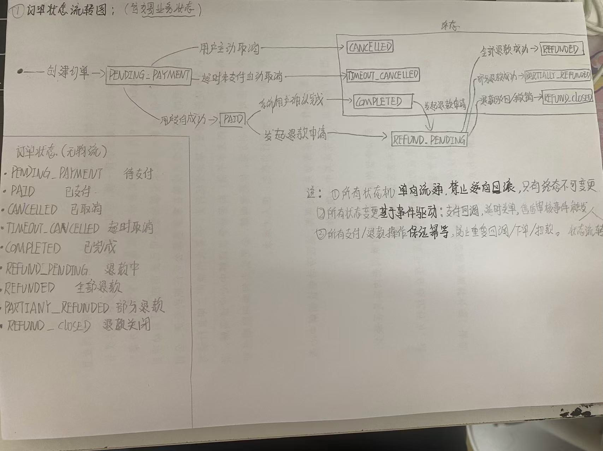
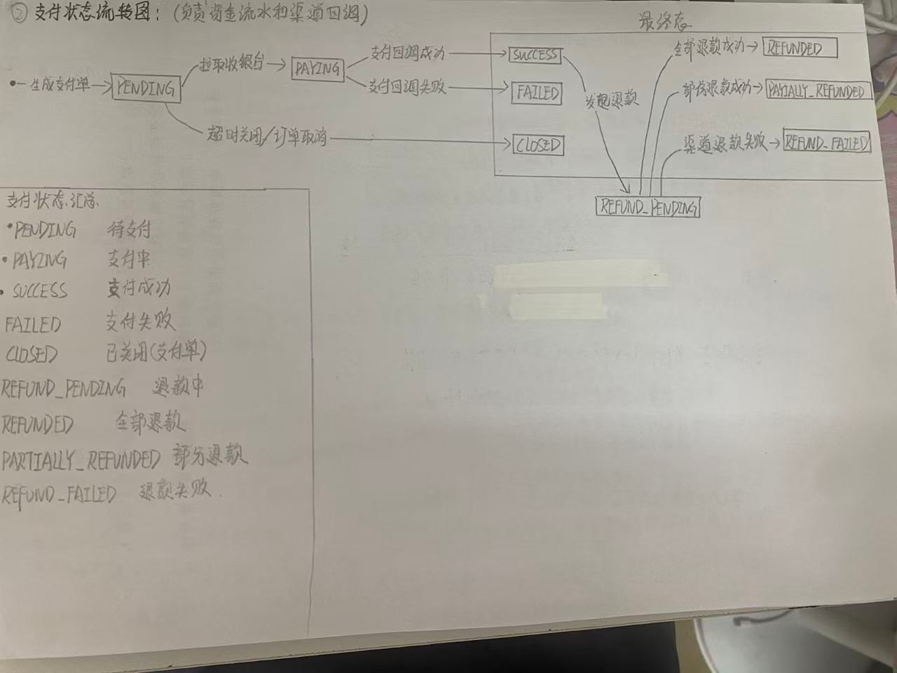
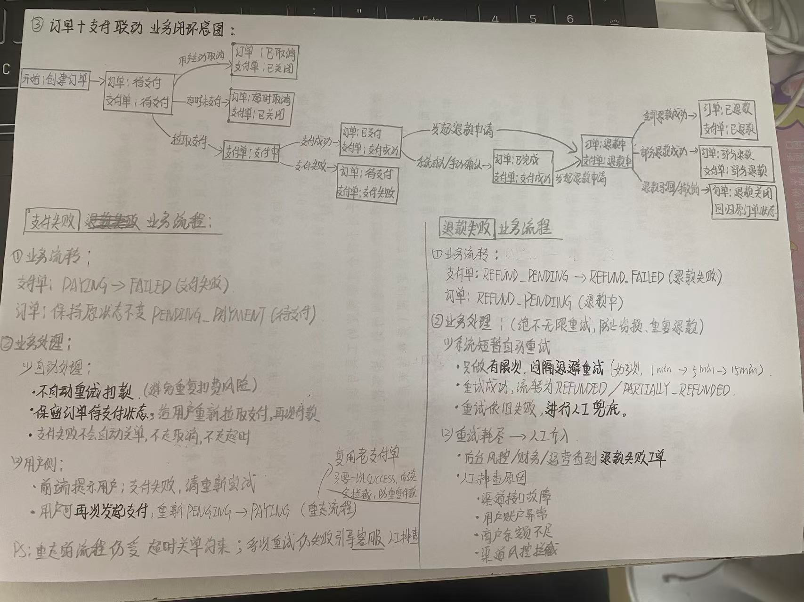
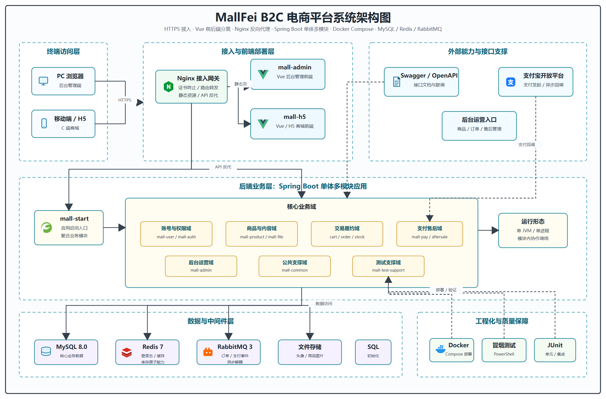
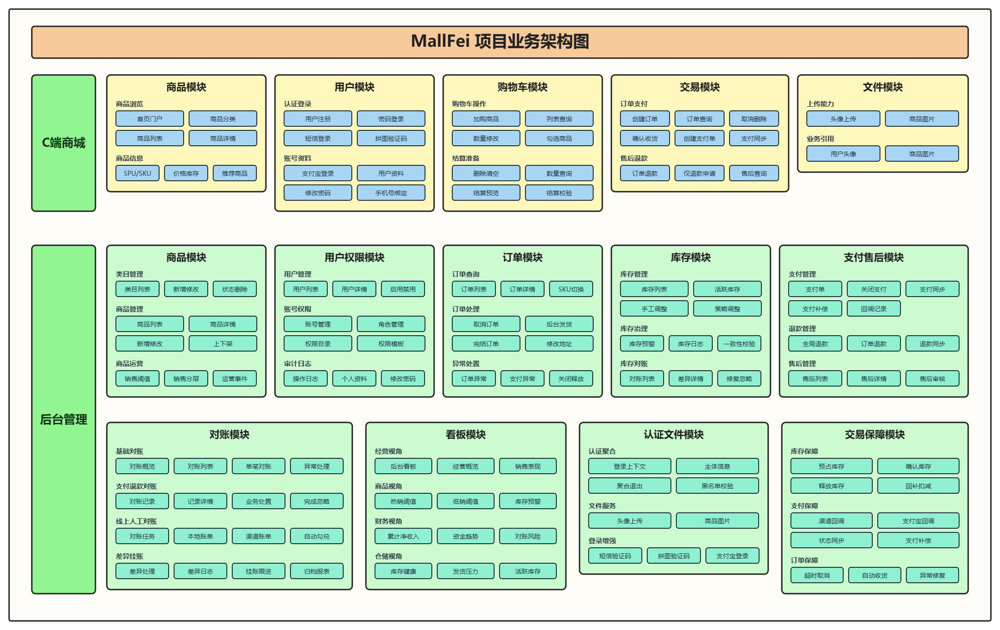

# mallFei

<p>
  <a href="https://mallfei.cloud"></a>
  <a href="https://mallfei.cloud/admin"></a>
  <a href="https://mallfei.cloud/api/swagger-ui/index.html"></a>
  
  
  
  
  
  
</p>

## 友情提示

> 1. **在线体验项目**：H5 商城：[https://mallfei.cloud](https://mallfei.cloud) 。
> 2. **后台管理系统**：[https://mallfei.cloud/admin](https://mallfei.cloud/admin) 。
> 3. **接口文档**：[https://mallfei.cloud/api/swagger-ui/index.html](https://mallfei.cloud/api/swagger-ui/index.html) 。
> 4. **项目定位**：本项目是面向面试展示与企业级电商业务实践的 B2C 电商系统，覆盖 MVP 到一期增强阶段。
> 5. **演示账号**：H5 与 Admin 测试账号在页面中有默认的。
> 6. **截图说明**：建议将 `项目运行截图.docx` 中的截图导出到 `documents/screenshots/`，在 README 中展示关键页面。

## 前言

`mallFei` 是一个从 0 到 1 搭建的企业级 B2C 电商项目，目标是完整覆盖电商系统中的用户、商品、SKU、购物车、订单、库存、支付、售后、后台运营、权限控制、操作日志、接口文档和云端部署等核心能力。

项目采用 **Spring Boot 3 + MyBatis-Plus + MySQL + Redis + RabbitMQ + Vue 3 + Vite + Nginx HTTPS** 技术栈，包含 C 端 H5 商城、Admin 后台管理端和后端多模块服务，支持线上 HTTPS 访问和前后端完整联调。

项目亮点主要体现在以下几个方面：

- **交易主链路完整**：从商品浏览、购物车、下单、库存预占、Mock 支付、订单状态流转、售后处理，到支付对账、退款同步和库存对账补偿，形成可演示、可排查、可修复的闭环。
- **库存系统设计完整**：围绕库存校验、Redis 原子预占、库存锁、库存日志、MQ 异步落库、库存释放/确认/回补、超时释放、库存校准补偿和库存对账设计，兼顾防超卖、幂等和可恢复性。
- **订单-支付状态设计明确**：订单、支付单、库存锁、超时关闭、支付确认、对账修复和售后退款之间保持清晰状态机，便于讲解交易一致性。
- **性能验证充分**：已完成商城下单核心接口压测，结果表明优化后可稳定支撑 60~100 并发的交易场景。
- **阶段化冒烟验证可复现**：已按 MVP 阶段、一期及一期增强阶段拆分 PowerShell 冒烟脚本，并形成执行报告；本地 9090 端口验证结果为 MVP `33 PASS / 2 SKIP / 0 FAIL`，一期及增强 `53 PASS / 36 SKIP / 0 FAIL`，可支撑后续单元测试、模块测试和集成测试。
- **云端部署可直接访问**：线上 H5、Admin、Swagger、HTTPS 与静态资源路由已配置完成，适合面试现场展示。

## 项目文档

项目需求、阶段设计和功能梳理文档位于：

```text
documents/
```

主要文档包括：

- [B2C 电商 MVP 项目开发主文档](documents/设计指导主文档/B2C电商MVP项目_开发主文档_后端.md)
- [B2C 电商一期及一期增强阶段正式开发设计文档](documents/设计指导主文档/B2C电商一期及一期增强阶段%20正式开发设计文档%20(1).md)
- [B2C 电商二期运营履约能力指导主文档](documents/设计指导主文档/B2C电商二期运营履约能力指导主文档.md)
- [B2C 电商三期平台经营能力开发主文档](documents/设计指导主文档/B2C电商三期平台经营能力开发主文档.md)
- [B2C 电商四期生产治理能力开发主文档](documents/设计指导主文档/B2C电商四期生产治理能力开发主文档.md)
- [B2C 电商五期平台化与智能化能力开发主文档](documents/设计指导主文档/B2C电商五期平台化与智能化能力开发主文档.md)
- [mallFei 项目已实现业务功能阶段梳理](documents/mallFei项目已实现业务功能阶段性梳理文档.md)
- [大型企业级 B2C 电商平台总体目标指导文档](documents/设计指导主文档/大型企业级B2C电商平台总体目标指导文档.md)
- [商城下单接口性能压测总结报告](documents/商城下单压力测试文档/商城下单接口性能压测总结报告.md)
- [MallFei 后端测试操作手册](documents/MallFei后端测试操作手册.md)
- [MallFei 阶段冒烟测试执行报告](documents/MallFei阶段冒烟测试执行报告.md)
- [云端一键部署运维手册](documents/MallFei商城项目%20云端一键部署运维手册（本地%2B云端分离版）.md)
- [MallFei AI 辅助开发心得总结](documents/MallFei_AI辅助开发心得总结.md)

## 项目介绍

`mallFei` 项目是一套 B2C 电商系统，包括 **前台 H5 商城系统**、**后台 Admin 管理系统** 和 **Spring Boot 多模块后端服务**。

前台商城系统围绕“浏览商品 -> 加入购物车 -> 提交订单 -> Mock 支付 -> 查看订单”这一条主交易链路设计，覆盖用户登录、个人资料、地址管理、商品分类、商品列表、商品详情、SKU 选择、购物车、结算预览、订单提交、支付状态流转、订单列表、订单详情和售后申请等模块。

后台管理系统围绕“运营可视化 + 履约管理 + 风控治理”设计，包含仪表盘、用户管理、商品分类管理、SPU/SKU 管理、商品上下架、库存管理、库存日志、订单管理、支付管理、售后管理、账号权限管理、操作日志、对账管理等模块。

后端服务采用 Maven 多模块组织，按业务领域拆分为用户、认证、商品、购物车、订单、库存、支付、售后、后台、文件、通用能力和启动模块，便于维护和扩展，也方便针对交易链路做独立优化和压测验证。

---

## 项目亮点

### 交易链路完整闭环

- C 端支持商品浏览、SKU 选择、购物车、结算、下单、Mock 支付、订单查询和售后申请。
- Admin 端支持商品、库存、订单、支付、售后、账号权限、操作日志和对账管理。
- 后端保存订单商品快照、收货地址快照、支付单、支付回调记录、退款单、库存锁记录、库存操作日志和库存对账记录，避免商品或地址后续变更影响历史订单，也便于问题追踪。
- 交易闭环不止“下单 -> 支付 -> 发货/售后”，还包含支付对账、订单支付状态同步、已支付订单修复、退款状态同步、库存对账、库存一致性校验和库存补偿释放，保证异常场景可发现、可定位、可修复。

### 库存系统与防超卖设计

- 下单前进行商品、SKU、上下架状态、库存、地址和结算数据等基础校验，避免无效订单进入库存预占链路。
- 库存链路采用 **Redis Lua 原子预占库存**，保障单 SKU 维度扣减的原子性；并通过库存锁记录标识订单维度的预占、确认、取消和释放状态。
- 使用库存操作日志承载幂等键和业务流水，降低重复下单、重复 MQ 消费、重复释放、重复确认带来的副作用。
- 库存预占失败时支持已成功预占项回滚释放，避免多 SKU 部分成功导致库存长期占用。
- 支付成功后确认库存，订单取消、超时关闭或支付失败时释放预占库存，售后退款/异常修复场景可通过回补接口恢复库存。
- 库存系统不是简单扣减：目前已经包含库存初始化、人工调整、策略更新、库存同步、预占、取消预占、确认、直接回补、锁定、释放、扣减等操作接口，并配合库存日志形成可审计链路。
- 通过 RabbitMQ 异步同步库存 DB，并结合 `StockTimeoutReleaseJob`、`StockReservationCompensationJob`、`StockReconciliationJob`、库存对账记录和库存一致性校验，覆盖超时释放、补偿释放、库存校准和库存对账能力。

### 订单-支付状态机设计

项目围绕订单状态、支付状态、库存锁状态、退款状态、售后状态和对账状态建立了清晰的业务状态流转。

- 订单创建后进入 `PENDING_PAYMENT`，同时创建支付单并预占库存。

- 用户主动取消、订单超时关闭、支付失败或支付单关闭时，订单进入关闭/取消链路，并释放已预占库存。

- Mock 支付或渠道支付回调成功后，支付单进入成功状态，订单从 `PENDING_PAYMENT` 条件更新为 `PAID`，避免重复支付确认造成重复加销量或重复确认库存。

- 支付成功后进入履约链路，后台可继续执行发货、完成、售后审核和退款处理；退款链路保留退款单状态，并支持退款状态同步。

- 支付模块提供支付对账、订单支付状态同步、已成功支付订单修复和退款状态同步接口，用于处理“渠道已成功但本地未更新”“退款渠道状态与本地状态不一致”等异常场景。

- 订单、支付、库存、售后和对账之间保留相对独立状态，降低单一状态字段承载过多业务语义的风险，也便于后续接入真实支付渠道、定时对账文件和自动修复任务。

下面三张图是初代订单/支付/退款状态设计草图，和当前代码实现保持同一套核心语义，可作为 README 中讲解状态机的辅助材料。








### 下单接口压测成果

已对商城下单核心接口完成 50、60、100 并发多轮压测和优化验证，详见：[商城下单接口性能压测总结报告](documents/商城下单压力测试文档/商城下单接口性能压测总结报告.md)。

| 压测轮次 | 并发 / 时长 | 结果概述 | 综合评价 |
| --- | --- | --- | --- |
| 初始版本 | 50 并发 / 40s | 成功率 100%，但存在 1s 以上长尾请求 | 及格 |
| 未优化版本 | 60 并发 / 40s | 成功率 100%，但出现 3s 级别峰值耗时和明显吞吐下降 | 不及格 |
| 优化后版本 | 60 并发 / 40s | 90% 以上请求稳定在 30~80ms，无 500ms 以上慢请求 | 优秀 |
| 最新版本 | 100 并发 / 40s | 成功率 100%，绝大多数请求稳定在 30~90ms，无 1s 以上恶性慢请求 | 优秀偏上 |

本轮性能优化主要包括：商品快照批量查询、订单明细批量插入、订单查询消除 N+1、库存预占批量加载与请求聚合、支付确认状态条件更新、库存日志唯一索引幂等插入、重复库存操作不再重复发布 MQ、高频成功日志降级等。

### 云端部署与线上演示

- 已完成 H5 商城、Admin 后台、后端 API、Swagger、上传资源和 WebSocket 的 Nginx HTTPS 统一代理。
- 支持本地构建、云端上传、后端进程重启、前端静态资源发布和 Nginx reload 的分步骤部署流程。
- 部署说明详见：[云端一键部署运维手册](documents/MallFei商城项目%20云端一键部署运维手册（本地%2B云端分离版）.md)。

---

## 项目演示

### H5 商城系统

项目演示地址：

[https://mallfei.cloud](https://mallfei.cloud)

建议使用浏览器手机模式访问，主要演示：

- 用户登录与个人中心
- 地址管理
- 商品分类与商品列表
- 商品详情与 SKU 选择
- 购物车数量和勾选状态维护
- 结算预览与提交订单
- Mock 支付
- 订单列表与订单详情
- 售后申请

项目截图请参考：[项目运行截图文档](documents/%E9%A1%B9%E7%9B%AE%E8%BF%90%E8%A1%8C%E6%88%AA%E5%9B%BE.docx)

### 后台管理系统

项目演示地址：

[https://mallfei.cloud/admin](https://mallfei.cloud/admin)

主要演示：

- 后台登录 / 退出
- 仪表盘经营指标
- 商品分类 / SPU / SKU 管理
- SKU 库存管理与库存日志
- 订单管理与订单详情
- 支付单管理
- 售后审核
- 账号角色权限
- 操作日志
- 对账管理

项目截图请参考：[项目运行截图文档](documents/%E9%A1%B9%E7%9B%AE%E8%BF%90%E8%A1%8C%E6%88%AA%E5%9B%BE.docx)

### 接口文档

Swagger UI：

[https://mallfei.cloud/api/swagger-ui/index.html](https://mallfei.cloud/api/swagger-ui/index.html)

---

## 组织结构

```text
mallFei
├── backend                         # Spring Boot 3 + Maven 多模块后端
│   ├── mall-common                 # 通用响应、异常、枚举、工具类
│   ├── mall-auth                   # 认证、Sa-Token、登录态、权限配置
│   ├── mall-user                   # C 端用户、地址、个人资料、第三方登录
│   ├── mall-product                # 商品分类、SPU、SKU、销量统计
│   ├── mall-cart                   # 购物车、勾选状态、结算前校验
│   ├── mall-order                  # 订单、订单项、订单状态流转、订单快照
│   ├── mall-stock                  # 库存、库存锁定、库存日志、库存预警
│   ├── mall-pay                    # 支付单、Mock 支付、支付回调、退款
│   ├── mall-aftersale              # 售后、退款申请、审核流程
│   ├── mall-admin                  # 后台管理、账号权限、运营管理
│   ├── mall-file                   # 文件上传、本地/对象存储适配
│   ├── mall-start                  # Spring Boot 启动模块
│   ├── scripts                     # 自动化冒烟测试与接口测试脚本
│   └── sql                         # 数据库结构和初始化脚本
├── frontend
│   ├── mall-h5                     # Vue3 + Vite + Vant H5 商城
│   └── mall-admin                  # Vue3 + Vite + Element Plus 后台管理
├── documents                       # 需求文档、设计文档、项目截图
├── docker-compose.yml              # MySQL / Redis / RabbitMQ 基础设施
└── README.md
```

---

## 技术选型

### 后端技术

| 技术 | 说明 | 官网 |
| --- | --- | --- |
| Spring Boot 3.3.5 | Web 应用开发框架 | https://spring.io/projects/spring-boot |
| Java 21 | 后端开发语言与运行环境 | https://www.oracle.com/java/ |
| Maven | 项目构建与多模块管理 | https://maven.apache.org/ |
| MyBatis-Plus 3.5.7 | ORM 与数据访问增强 | https://baomidou.com/ |
| MySQL 8.0 | 关系型数据库 | https://www.mysql.com/ |
| Redis 7 | 缓存与登录态支持 | https://redis.io/ |
| RabbitMQ 3 | 消息队列 | https://www.rabbitmq.com/ |
| Sa-Token 1.39.0 | 登录认证与权限控制 | https://sa-token.cc/ |
| Spring AMQP | RabbitMQ 集成 | https://spring.io/projects/spring-amqp |
| Springdoc OpenAPI | Swagger API 文档 | https://springdoc.org/ |
| BCrypt | 密码加密 | https://spring.io/projects/spring-security |
| Nginx | 反向代理与静态资源服务 | https://nginx.org/ |
| Docker | 基础设施容器化 | https://www.docker.com/ |

### 前端技术

| 技术 | 说明 | 官网 |
| --- | --- | --- |
| Vue 3 | 前端框架 | https://vuejs.org/ |
| Vite 6 | 前端构建工具 | https://vitejs.dev/ |
| Vue Router | 前端路由 | https://router.vuejs.org/ |
| Pinia | 状态管理 | https://pinia.vuejs.org/ |
| Axios | HTTP 请求库 | https://axios-http.com/ |
| Vant 4 | H5 移动端 UI 组件库 | https://vant-ui.github.io/vant/ |
| Element Plus | Admin 后台 UI 组件库 | https://element-plus.org/ |
| ECharts | 后台图表与数据看板 | https://echarts.apache.org/ |
| xlsx | 后台 Excel 导出 | https://github.com/SheetJS/sheetjs |

### 部署技术

| 技术 | 说明 |
| --- | --- |
| Ubuntu Server | 云服务器运行环境 |
| Nginx HTTPS | 全站 HTTPS、80 跳转 443、反向代理 |
| Docker MySQL | 数据库容器化运行 |
| Docker Redis | Redis 容器化运行 |
| Docker RabbitMQ | RabbitMQ 容器化运行 |
| Spring Boot 进程 | 后端服务运行 |
| 静态资源部署 | H5 与 Admin 分目录部署 |

---

## 架构图

### 系统架构图



### 业务架构图



---

## 模块介绍

### 前台商城系统 `frontend/mall-h5`

- 首页门户
- 商品分类
- 商品列表
- 商品详情
- SKU 选择
- 购物车
- 结算预览
- 地址管理
- 订单流程
- Mock 支付
- 订单中心
- 个人中心
- 售后申请

### 后台管理系统 `frontend/mall-admin`

- 仪表盘
- 用户管理
- 商品管理
- 分类管理
- 库存管理
- 库存日志
- 订单管理
- 支付管理
- 售后管理
- 对账管理
- 账号权限
- 操作日志
- 个人中心

### 后端业务模块

| 模块 | 说明 |
| --- | --- |
| `mall-common` | 通用响应、分页、异常、枚举、密码加密、认证注解 |
| `mall-auth` | Sa-Token 登录态、权限校验、会话管理、强制下线 WebSocket |
| `mall-user` | 用户注册登录、个人资料、地址管理、第三方登录配置 |
| `mall-product` | 分类、SPU、SKU、商品快照、销量统计 |
| `mall-cart` | 购物车、数量维护、勾选状态、结算校验 |
| `mall-order` | 订单创建、订单项、订单状态、地址快照、商品快照 |
| `mall-stock` | SKU 库存、库存锁定、库存日志、库存预警、一致性校验 |
| `mall-pay` | 支付单、Mock 支付、支付回调、退款单、支付对账 |
| `mall-aftersale` | 售后申请、售后审核、退款处理 |
| `mall-admin` | 后台账号、角色权限、运营管理、日志审计 |
| `mall-file` | 文件上传、本地存储和对象存储适配 |
| `mall-start` | 应用启动、全局配置、OpenAPI、MyBatis 配置 |

---

## 功能清单

### MVP 核心能力

- 用户注册并登录
- 用户维护个人资料
- 地址新增、编辑、删除、设置默认
- 后台管理员登录
- 后台维护分类、SPU、SKU
- 后台维护 SKU 库存
- C 端查看分类、商品列表、商品详情
- C 端选择 SKU 加入购物车
- 用户修改购物车数量和勾选状态
- 用户进行结算预览
- 用户选择地址提交订单
- 系统生成订单和订单项
- 订单项保存商品名称、图片、价格等快照
- 订单保存收货地址快照
- 下单时完成基础库存校验和处理
- 系统创建支付单
- 用户通过 Mock 支付完成支付
- 支付成功后支付单状态变为成功
- 支付成功后订单状态变为已支付
- 用户查看订单列表和订单详情
- 用户不能查看他人订单
- 后台查看订单、用户、库存
- C 端和 Admin 端核心流程完整联调
- 接口文档覆盖 MVP 核心接口
- MVP 主链路无阻断性异常

### 一期增强能力

- 后台仪表盘经营数据
- 后台账号、角色、权限管理
- 管理员强制下线与登录态治理
- 用户禁用 / 启用管理
- 商品上下架与违规处理
- 商品销量统计与阈值配置
- 库存预警与库存日志
- 库存一致性校验
- 订单发货、完成、异常处理
- 支付单同步、关闭、修复
- 售后申请与后台审核
- 支付回调记录
- 支付 / 库存对账管理
- 操作日志审计
- Admin 子路径部署与 H5 路由隔离

---

## 开发进度

| 阶段 | 状态 | 说明 |
| --- | --- | --- |
| MVP 阶段 | 已完成 | 用户、商品、购物车、订单、库存、支付主链路 |
| 一期增强 | 已完成主要能力 | 后台运营、权限、履约、售后、日志、对账基础能力 |
| 二期规划 | 规划中 | 更完整履约、营销、优惠券、物流能力 |
| 三期规划 | 规划中 | 平台经营分析、数据看板、运营策略 |
| 四期规划 | 规划中 | 生产治理、监控、对账、自动修复 |
| 五期规划 | 规划中 | 平台化、智能化、推荐与自动化运营 |

---

## 环境搭建

### 开发工具

| 工具 | 说明 | 官网 |
| --- | --- | --- |
| IntelliJ IDEA | Java 后端开发 IDE | https://www.jetbrains.com/idea/ |
| Cursor / VS Code | 前端与全栈开发工具 | https://code.visualstudio.com/ |
| Docker Desktop | 本地容器运行环境 | https://www.docker.com/ |
| Navicat / DBeaver | 数据库客户端 | https://dbeaver.io/ |
| Postman / Apifox | API 调试工具 | https://www.postman.com/ |
| PowerShell | 自动化测试脚本运行 | https://learn.microsoft.com/powershell/ |
| Git | 版本控制 | https://git-scm.com/ |

### 开发环境

| 工具 | 版本 |
| --- | --- |
| JDK | 21 |
| Maven | 3.9+ |
| Node.js | 18+ / 20+ |
| MySQL | 8.0 |
| Redis | 7.x |
| RabbitMQ | 3.x Management |
| Nginx | 1.20+ |

### 本地启动基础设施

项目根目录执行：

```bash
docker compose up -d
```

默认服务：

| 服务 | 地址 |
| --- | --- |
| MySQL | `127.0.0.1:3306` |
| Redis | `127.0.0.1:6379` |
| RabbitMQ | `127.0.0.1:5672` |
| RabbitMQ 控制台 | `http://127.0.0.1:15672` |

### 初始化数据库

建议数据库名：

```text
mall_fei
```

数据库脚本目录：

```text
backend/sql
```

### 启动后端

```bash
cd backend
mvn clean package -DskipTests
cd mall-start
mvn spring-boot:run
```

本地后端地址：

```text
http://127.0.0.1:9090
```

常用环境变量：

```bash
SPRING_PROFILES_ACTIVE=local
MALL_MYSQL_HOST=127.0.0.1
MALL_MYSQL_PORT=3306
MALL_MYSQL_DATABASE=mall_fei
MALL_MYSQL_USERNAME=root
MALL_MYSQL_PASSWORD=123456
MALL_REDIS_HOST=127.0.0.1
MALL_REDIS_PORT=6379
MALL_RABBITMQ_HOST=127.0.0.1
MALL_RABBITMQ_PORT=5672
MALL_RABBITMQ_USERNAME=guest
MALL_RABBITMQ_PASSWORD=guest
```

### 启动 H5 商城

```bash
cd frontend/mall-h5
npm install
npm run dev
```

默认地址：

```text
http://127.0.0.1:5173
```

### 启动 Admin 后台

```bash
cd frontend/mall-admin
npm install
npm run dev:local
```

默认地址：

```text
http://127.0.0.1:5174
```

---

## 前端构建与部署

### H5 商城构建

```bash
cd frontend/mall-h5
npm run build
```

构建产物：

```text
frontend/mall-h5/dist
```

### Admin 后台构建

```bash
cd frontend/mall-admin
npm run build
```

构建产物：

```text
frontend/mall-admin/dist
```

Admin 线上构建默认使用：

```text
base: /admin/
```

### 云端部署说明

线上目录：

```text
/var/www/mall-h5       # H5 商城
/var/www/mall-admin    # Admin 后台
```

Nginx 路由：

```text
/              -> /var/www/mall-h5
/admin/        -> /var/www/mall-admin
/api/          -> Spring Boot 后端
/uploads/      -> 后端上传资源
/ws/           -> 后端 WebSocket
```

常用部署命令：

```bash
sudo nginx -t
sudo systemctl reload nginx
```

---

## 支付宝登录与支付沙箱说明

项目预留并接入了支付宝相关配置能力，包含：

- 支付宝沙箱网关配置
- 支付宝支付参数配置
- 支付回调地址配置
- 支付返回地址配置
- C 端支付完成后的返回页
- 用户支付宝登录回调配置

本地开发默认可以关闭真实支付宝能力，使用 Mock 支付完成主链路验证。

常用配置项：

```bash
MALL_PAY_ALIPAY_ENABLED=false
MALL_PAY_ALIPAY_GATEWAY=https://openapi-sandbox.dl.alipaydev.com/gateway.do
MALL_PAY_ALIPAY_APP_ID=
MALL_PAY_ALIPAY_PRIVATE_KEY=
MALL_PAY_ALIPAY_PUBLIC_KEY=
MALL_PAY_ALIPAY_NOTIFY_URL=
MALL_PAY_ALIPAY_RETURN_URL=
MALL_PAY_ALIPAY_CLIENT_RETURN_URL=
```

---

## 自动化测试

后端提供 PowerShell 自动化测试脚本，覆盖用户、商品、购物车、订单、支付、后台与阶段业务流。

脚本目录：

```text
backend/scripts
```

常用脚本：

| 脚本 | 说明 |
| --- | --- |
| `smoke-test-mvp.ps1` | MVP 阶段冒烟测试，覆盖商品浏览、用户注册/资料、地址、购物车、结算、下单、Mock 支付、用户订单、后台基础管理等核心交易闭环 |
| `smoke-test-phase1-enhanced.ps1` | 一期及一期增强阶段冒烟测试，覆盖订单异常处理、支付同步、售后退款、库存日志/预警、基础对账、线上人工对账、Dashboard 增强、权限审计和认证增强入口 |
| `smoke-test.ps1` | 历史基础冒烟测试脚本 |
| `run-api-tests.ps1` | API 测试入口 |
| `e2e-business-flow-tests.ps1` | 端到端业务流测试 |
| `p1-business-flow-tests.ps1` | 一期业务流测试 |
| `test-user.ps1` | 用户模块测试 |
| `test-product.ps1` | 商品模块测试 |
| `test-order-pay.ps1` | 订单支付测试 |
| `test-admin.ps1` | 后台模块测试 |

阶段化冒烟测试运行示例：

```powershell
cd backend/scripts

# MVP 核心交易闭环冒烟测试，默认访问 http://localhost:9090
./smoke-test-mvp.ps1

# 一期及一期增强能力入口冒烟测试，可复用 MVP 脚本生成的订单号
./smoke-test-phase1-enhanced.ps1 -OrderNo "ORD1782478440821F28189"

# 如需遇到业务失败即中断，可追加 -Strict
./smoke-test-mvp.ps1 -Strict
```

最近一次阶段化冒烟测试执行结果如下，详见：[MallFei 阶段冒烟测试执行报告](documents/MallFei阶段冒烟测试执行报告.md)。

| 脚本 | 覆盖阶段 | PASS | SKIP | FAIL | 结论 |
| --- | --- | ---: | ---: | ---: | --- |
| `smoke-test-mvp.ps1` | MVP 阶段 | 33 | 2 | 0 | 核心交易闭环通过，可支撑继续进入后续测试 |
| `smoke-test-phase1-enhanced.ps1` | 一期及一期增强阶段 | 53 | 36 | 0 | 主要后台管理、支付、库存、售后、对账、Dashboard、权限审计接口具备基本可访问性 |

> 冒烟测试中的 SKIP 主要来自验证码策略、multipart 文件上传、支付宝本地配置缺失、订单/售后/退款/对账等状态敏感接口缺少专项数据。上述结果表示系统未发现阻断性问题，已具备进入单元测试、模块测试、集成测试和专项验证的前置条件。

### 后端单元测试、模块测试与集成测试

除脚本化接口测试外，后端已经补充 Maven/JUnit 自动化测试体系，覆盖核心领域规则、模块协作和轻量集成链路。详细操作说明见：[MallFei 后端测试操作手册](documents/MallFei后端测试操作手册.md)。

当前测试体系按三层设计：

| 测试类型 | 命名特征 | 公共基类 | 主要验证目标 | 执行特点 |
| --- | --- | --- | --- | --- |
| 单元测试 | `*DomainServiceTest` | `BaseUnitTest` | 领域模型、领域服务、业务状态机、异常边界 | 不启动 Spring，不连接真实中间件 |
| 模块测试 | `*ModuleStandardTest` | `BaseModuleTest` | 单模块内 Bean 装配、模块协作流程、关键业务闭环 | 可启动轻量 Spring TestContext，外部依赖 Mock |
| 集成测试 | `*IntegrationTest` | `BaseIntegrationTest` | HTTP API、MQ 发布、Controller 到 Application Service 链路 | 当前以轻量集成为主，默认不连接真实 MySQL/Redis/RabbitMQ |

公共测试支撑模块位于：

```text
backend/mall-test-support
```

目前已覆盖的代表性测试包括：

| 模块 | 测试文件 | 覆盖重点 |
| --- | --- | --- |
| `mall-auth` | `AuthDomainServiceTest` | 登录主体校验、身份类型授权边界 |
| `mall-user` | `UserDomainServiceTest` | 用户领域规则、登录/资料相关边界 |
| `mall-product` | `ProductDomainServiceTest` | 商品与 SKU 领域规则 |
| `mall-cart` | `CartDomainServiceTest`、`CartModuleStandardTest`、`CartApiIntegrationTest` | 购物车增删改查、勾选、结算校验、接口链路 |
| `mall-order` | `OrderDomainServiceTest`、`OrderModuleStandardTest`、`OrderMqIntegrationTest` | 订单创建、金额计算、状态流转、超时取消、MQ 行为 |
| `mall-stock` | `StockDomainServiceTest`、`StockModuleStandardTest` | 库存预占、释放、确认、防超卖、幂等边界 |
| `mall-pay` | `PayOrderDomainServiceTest`、`PayModuleStandardTest`、`PayMqIntegrationTest` | 支付单状态机、支付回调幂等、金额校验、MQ 行为 |
| `mall-file` | `FileDomainServiceTest` | 文件领域规则 |
| `mall-aftersale` | `AftersaleDomainServiceTest` | 售后申请、审核、退款前置规则 |

常用执行命令：

```powershell
cd backend

# 执行后端全量测试
mvn test

# 执行指定模块测试，并自动构建其依赖模块
mvn -pl mall-auth -am test
mvn -pl mall-order -am test
mvn -pl mall-pay -am test

# 执行指定测试类
mvn -pl mall-order -am -Dtest=OrderDomainServiceTest test

# 执行指定测试方法
mvn -pl mall-pay -am -Dtest=PayModuleStandardTest#shouldKeepCallbackIdempotent test
```

> 多模块项目中，如果单独执行某个模块测试，建议使用 `-am` 参数，让 Maven 同时构建该模块依赖的本地模块，例如 `mall-common`、`mall-test-support` 等，避免本地依赖尚未安装导致解析失败。

最近一次后端全量 Maven 测试已经通过，执行结果如下：

```text
[INFO] mall-backend ....................................... SUCCESS [  0.002 s]
[INFO] mall-common ........................................ SUCCESS [  0.961 s]
[INFO] mall-test-support .................................. SUCCESS [  0.127 s]
[INFO] mall-auth .......................................... SUCCESS [  0.897 s]
[INFO] mall-stock ......................................... SUCCESS [  2.975 s]
[INFO] mall-product ....................................... SUCCESS [  1.615 s]
[INFO] mall-order ......................................... SUCCESS [  3.248 s]
[INFO] mall-pay ........................................... SUCCESS [  2.964 s]
[INFO] mall-user .......................................... SUCCESS [  2.082 s]
[INFO] mall-cart .......................................... SUCCESS [  4.079 s]
[INFO] mall-aftersale ..................................... SUCCESS [  1.737 s]
[INFO] mall-admin ......................................... SUCCESS [  0.120 s]
[INFO] mall-file .......................................... SUCCESS [  1.619 s]
[INFO] mall-start ......................................... SUCCESS [  0.166 s]
[INFO] BUILD SUCCESS
[INFO] Total time:  22.887 s
[INFO] Finished at: 2026-06-26T20:22:09+08:00
```

测试通过的判断标准：

- Maven 输出 `BUILD SUCCESS`；
- Reactor Summary 中后端各模块均为 `SUCCESS`；
- Surefire 结果中 `Failures: 0`、`Errors: 0`；
- 如需查看单个模块详情，可查看各模块的 `target/surefire-reports/` 目录。

在业务层面，一个订单可判断为“成功订单”的核心标准是：订单已创建并生成有效订单号，订单金额与订单明细汇总一致，库存预占成功，支付单支付成功，订单状态从待支付推进到已支付，并且重复支付回调、重复库存确认、重复 MQ 消费不会导致金额、库存或订单状态被重复变更。

---

## 项目截图

项目运行截图已整理为文档，可直接查看：

[项目运行截图文档](documents/%E9%A1%B9%E7%9B%AE%E8%BF%90%E8%A1%8C%E6%88%AA%E5%9B%BE.docx)

如果你想在 README 中继续补图，建议只保留关键页面，避免内容过长影响阅读体验。

可优先展示以下内容：

| 截图 | 建议文件名 |
| --- | --- |
| H5 商城首页 | `h5-home.png` |
| H5 登录 / 个人中心 | `h5-profile.png` |
| 商品详情与 SKU | `h5-product-detail.png` |
| 购物车 | `h5-cart.png` |
| 结算页 | `h5-checkout.png` |
| 订单详情 | `h5-order-detail.png` |
| Admin 登录页 | `admin-login.png` |
| Admin 仪表盘 | `admin-dashboard.png` |
| 商品管理 | `admin-product.png` |
| 库存管理 | `admin-stock.png` |
| 订单管理 | `admin-order.png` |
| 支付管理 | `admin-pay.png` |
| 售后管理 | `admin-aftersale.png` |
| 账号权限 | `admin-account.png` |
| Swagger 文档 | `swagger.png` |
| 部署架构图 | `deploy-arch.png` |

---

## 后续规划

- 完善真实支付宝支付与退款闭环
- 完善支付宝登录生产化接入
- 增加优惠券、满减、营销活动、秒杀能力
- 增加订单超时自动关闭与延迟队列治理
- 增加库存一致性定时巡检与自动修复
- 增加支付对账文件导入与差异处理闭环
- 增加后台数据大屏与经营分析指标
- 增加更完整的单元测试、集成测试与 CI/CD
- 增加 Docker Compose 一键部署全量应用配置
- 补充完整截图目录、架构图和面试展示材料

---

## 许可证

本项目用于个人学习、面试展示和电商系统业务实践。如需商业使用，请结合实际业务合规要求进行安全、隐私、支付和资质审查。

---

## 项目状态

当前项目已完成 MVP 到一期增强阶段的主要能力：

- C 端商城主交易链路可跑通
- Admin 后台核心运营管理可用
- 订单、库存、支付、售后具备基础闭环
- 后台权限、操作日志、接口文档已具备
- 线上 HTTPS 环境已部署

适合作为 Java 后端 / 全栈开发方向的简历项目、面试讲解项目和电商业务系统实践项目。
